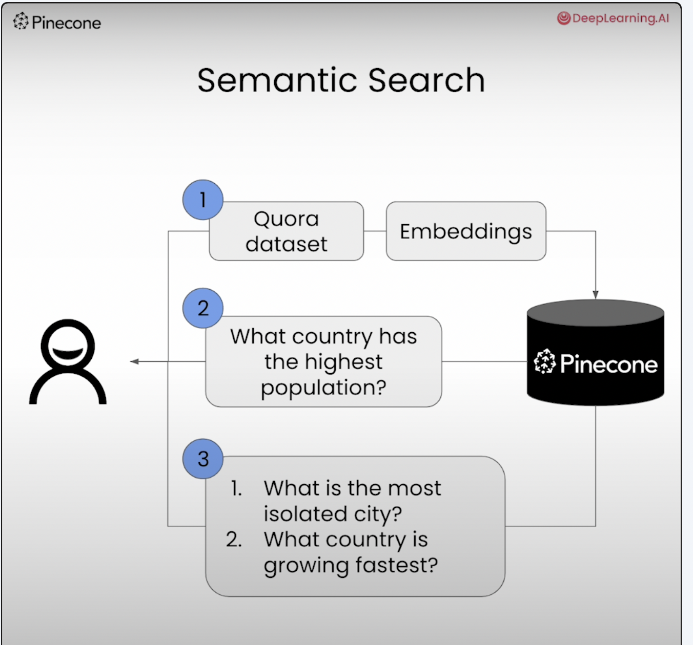

## Building Applications with VectorDB

The following notes are from my learning journey while taking the course from Deeplearning.ai

(Building Applications with VectorDB - Pinecone)[https://learn.deeplearning.ai/courses/building-applications-vector-databases/lesson/1/introduction]

### Lesson 1 - Semantic Search

We will build the following:

### Lesson 2 - RAG

### Lesson 3 - Recommender System

### Lesson 4 - Hybrid Search

### Lesson 5 - Facial Similarity Search

### Lesson 6 - Anomaly Detection

