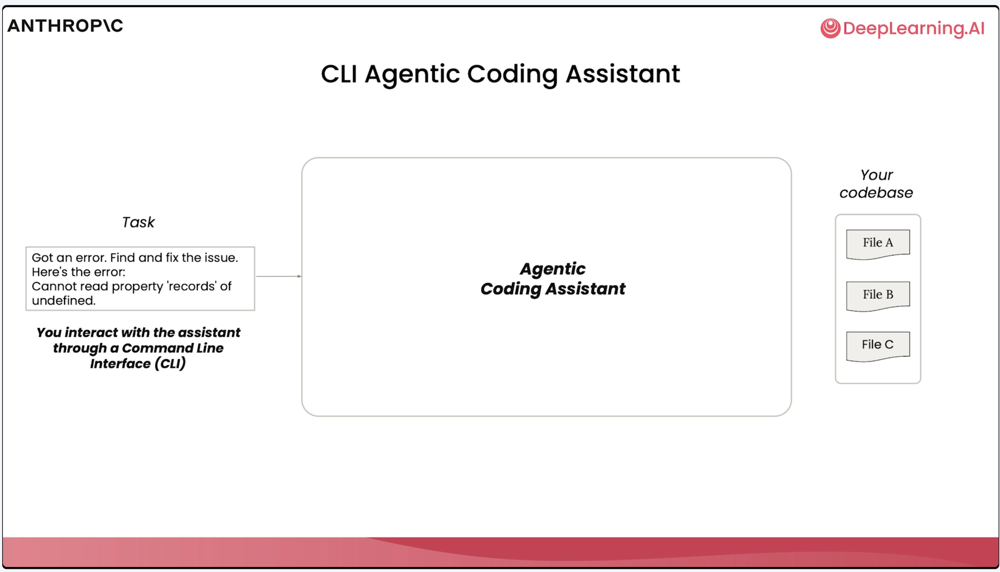
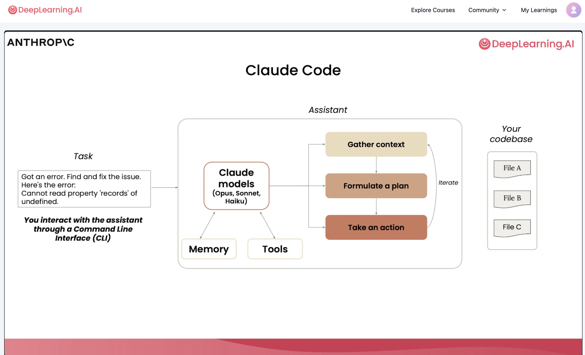
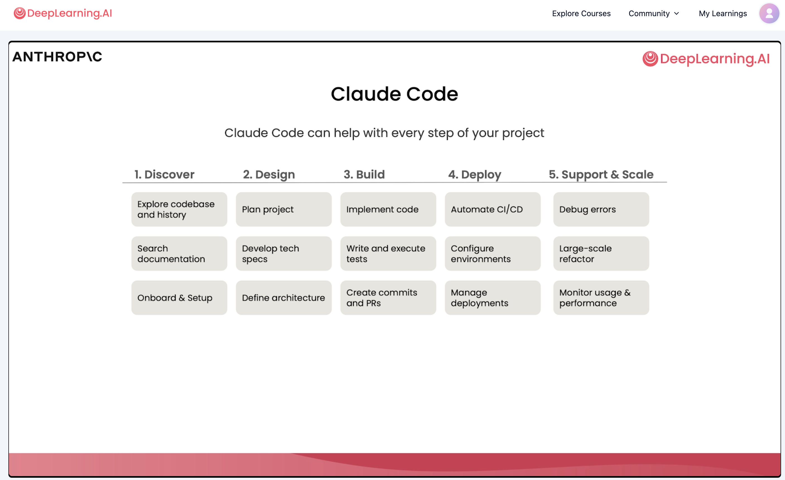
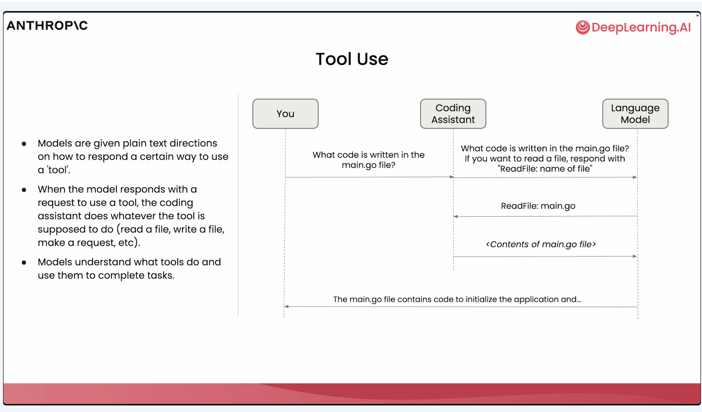
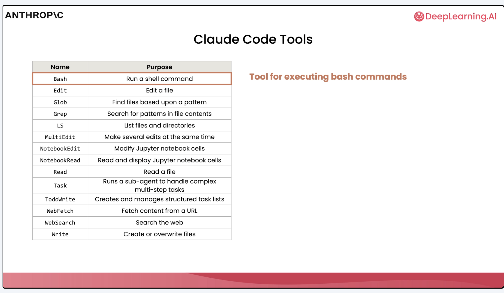
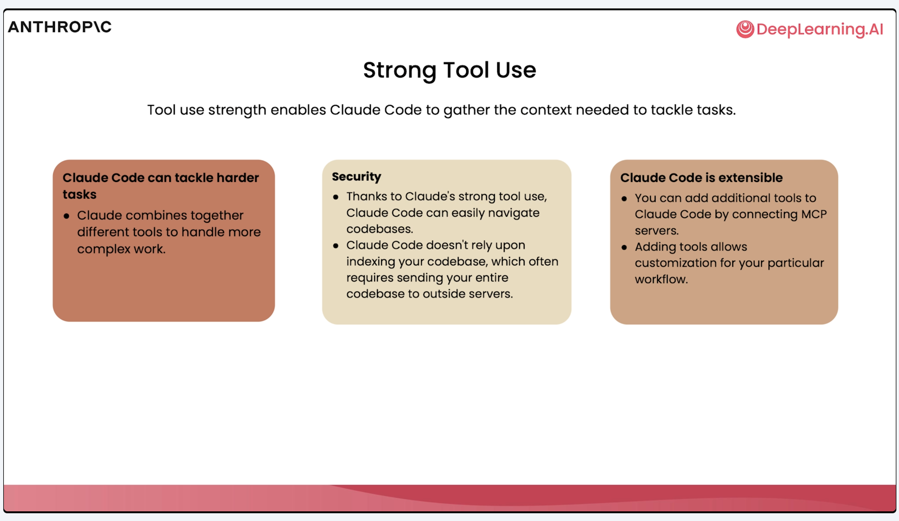
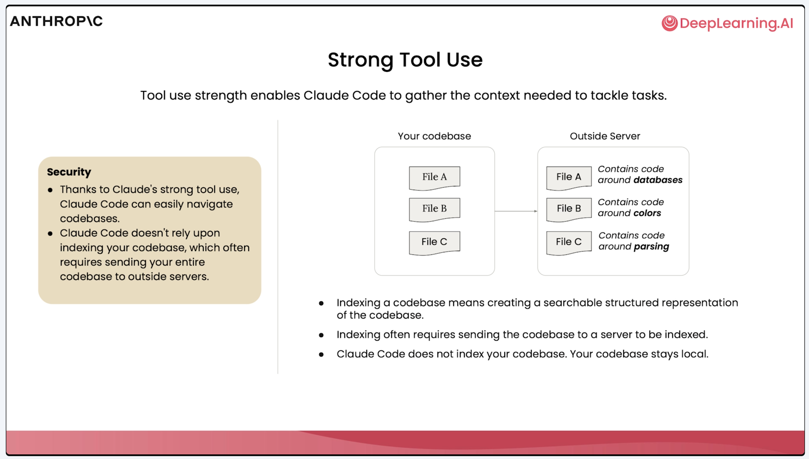
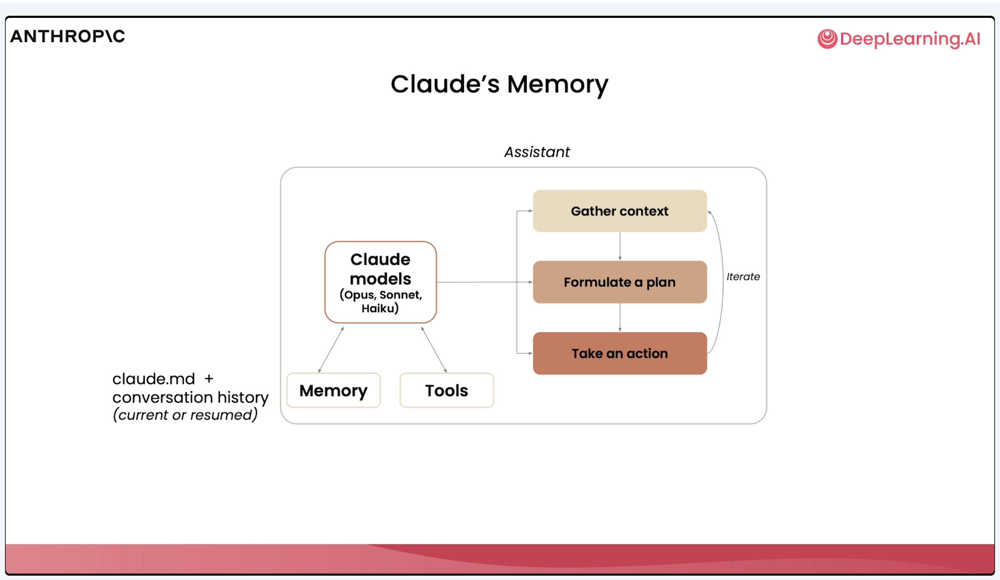

Following notes are from the course [Claude Code: A Highly Agentic Coding Assistant](https://learn.deeplearning.ai/courses/claude-code-a-highly-agentic-coding-assistant/lesson/rrigm/what-is-claude-code?)

# Chap 1. What is Claude Code

