## Preprocessing Unstructured Data For LLM Applications

This course material came from the course Taught by deeplearning.ai. You can find the course [here](https://learn.deeplearning.ai/courses/preprocessing-unstructured-data-for-llm-applications/)

### Chapter 1 Overview of LLM Data Pre-processing

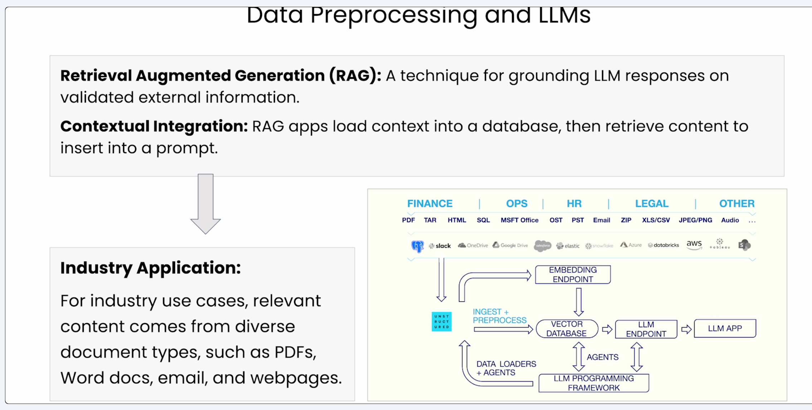

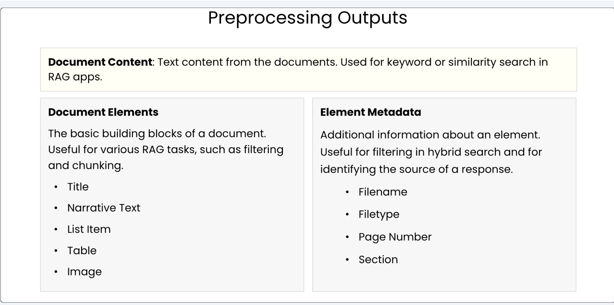

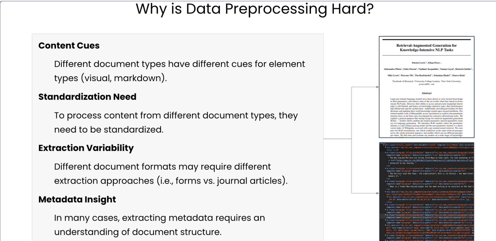

### Chapter 2 Normalizing the Content

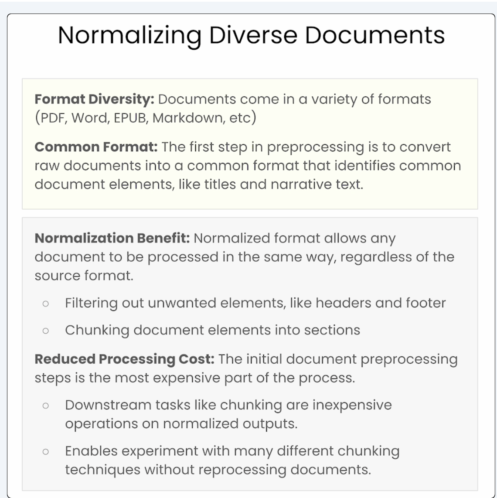

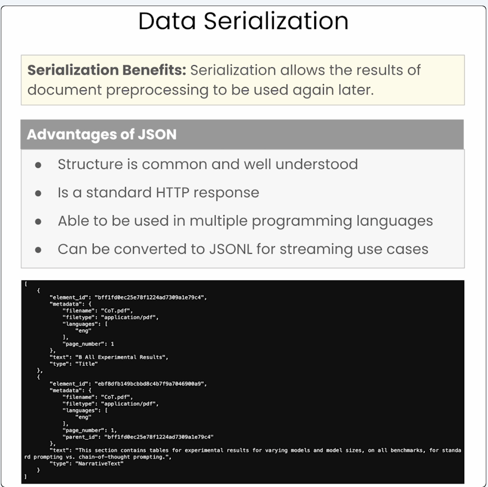

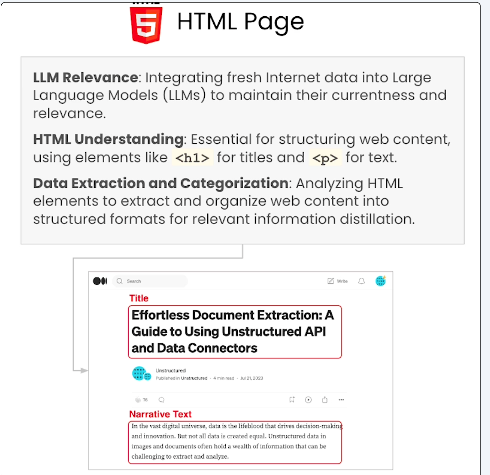

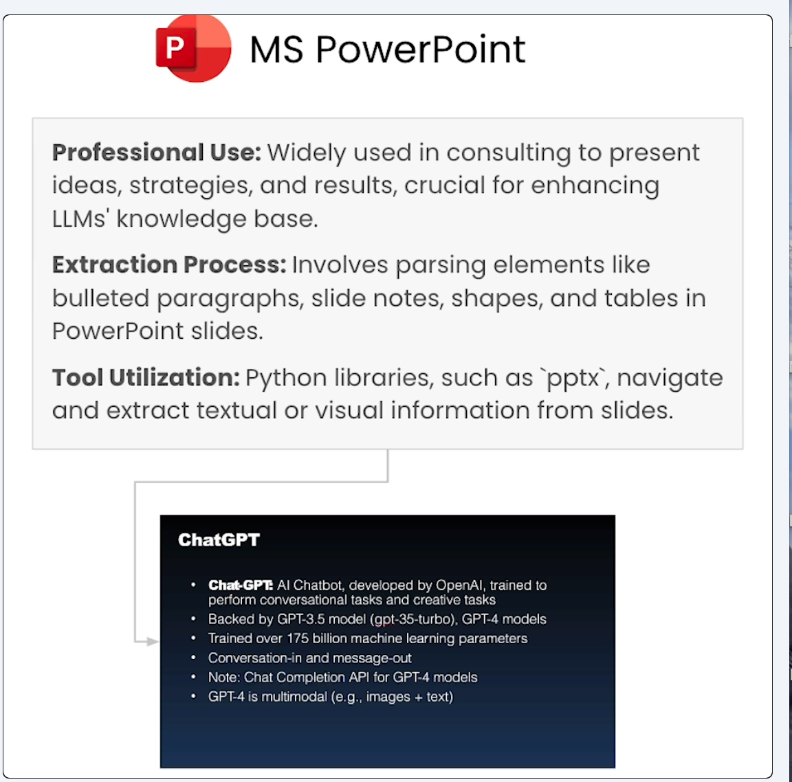

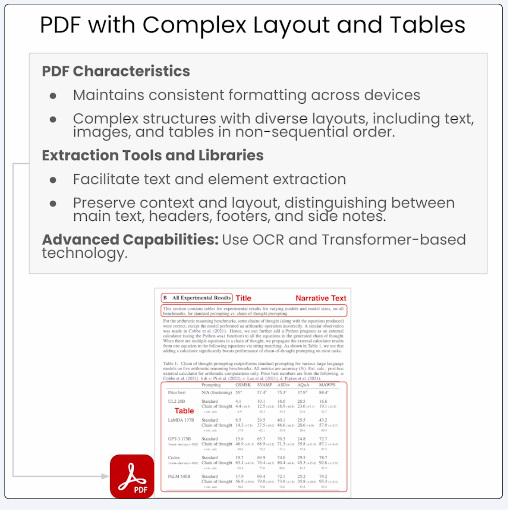

### Chapter 3 Metadata Extraction and Chunking

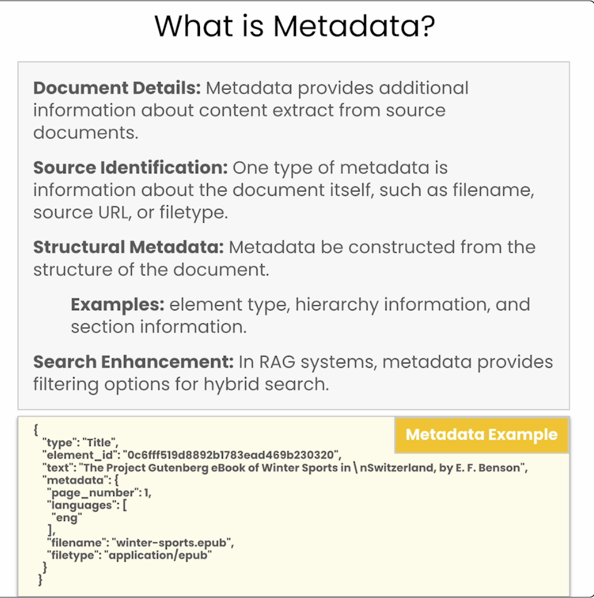

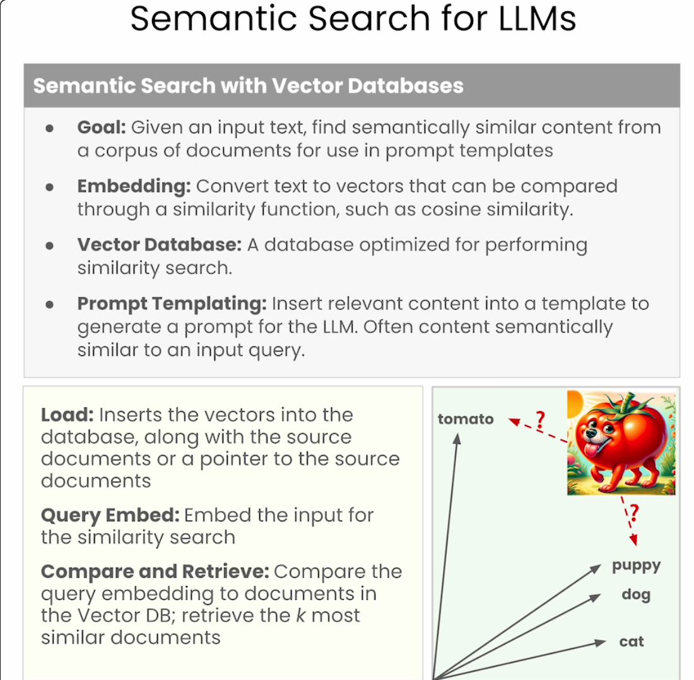

![Hybrid Search(image-10.png)

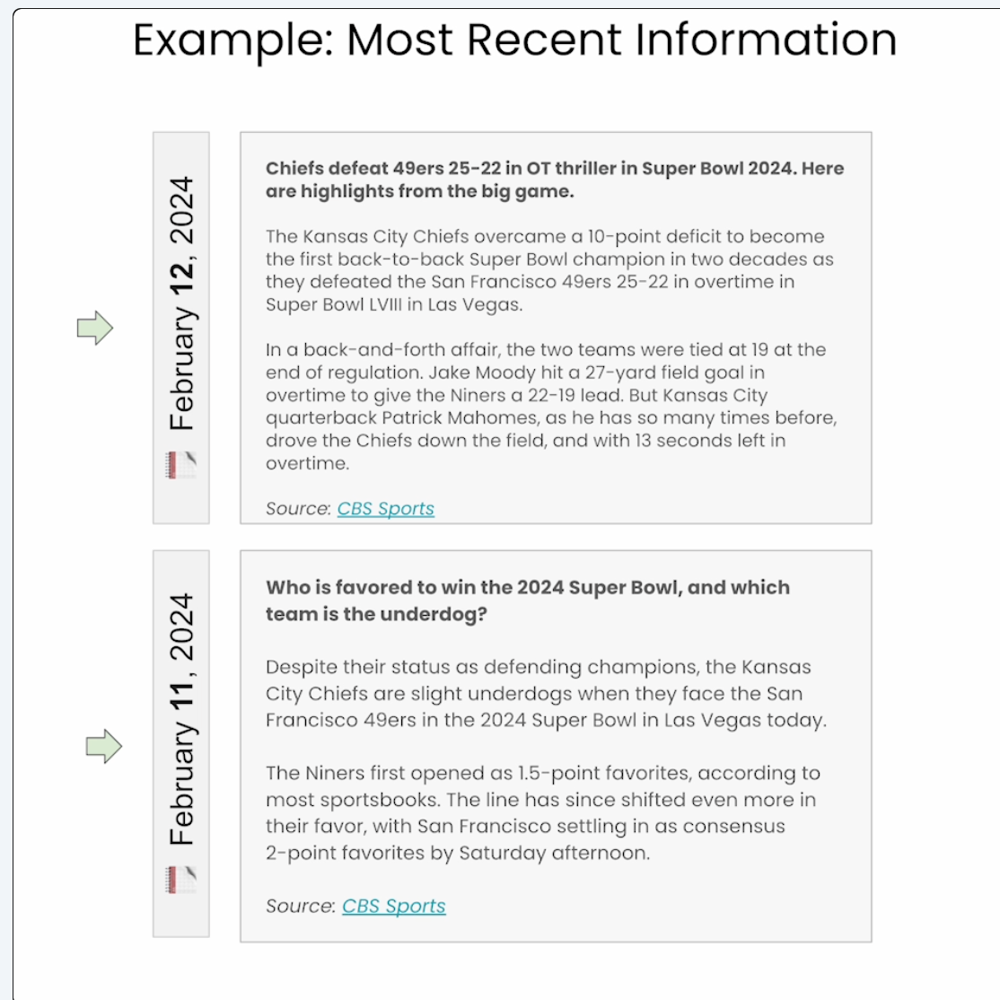

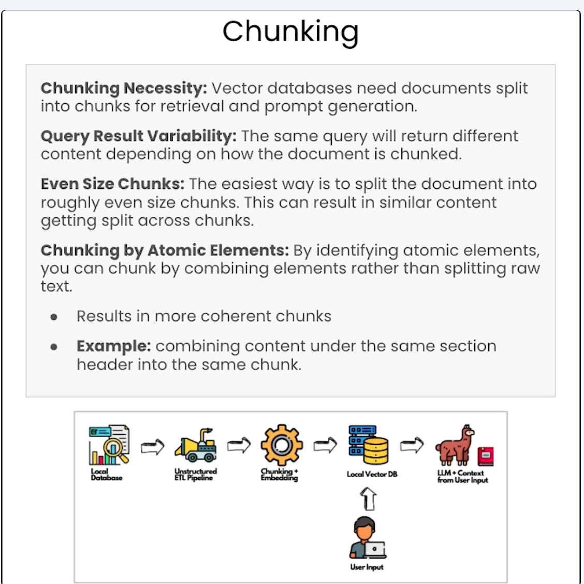