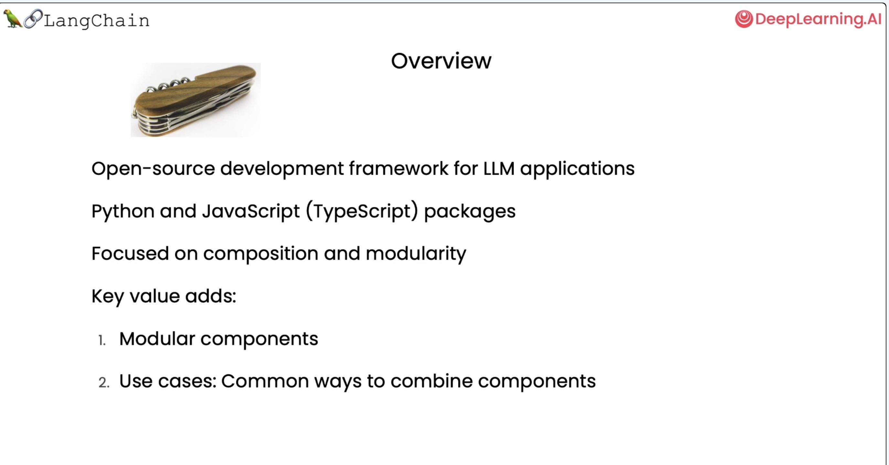
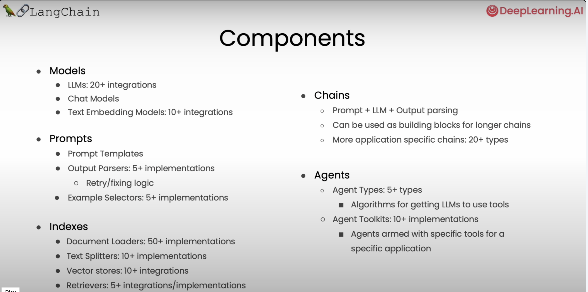
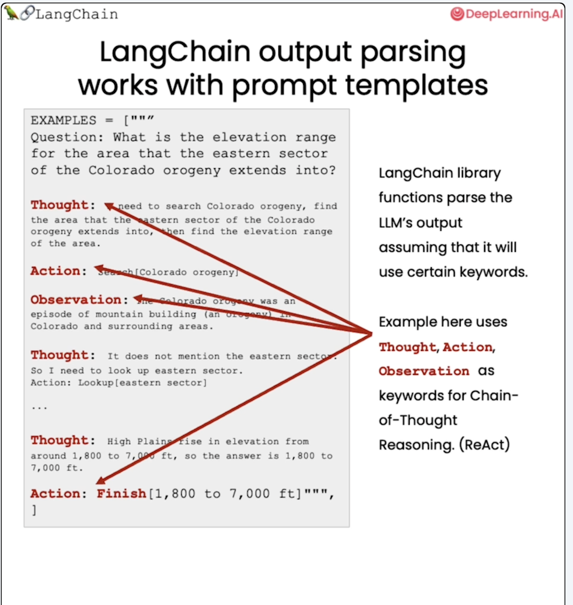
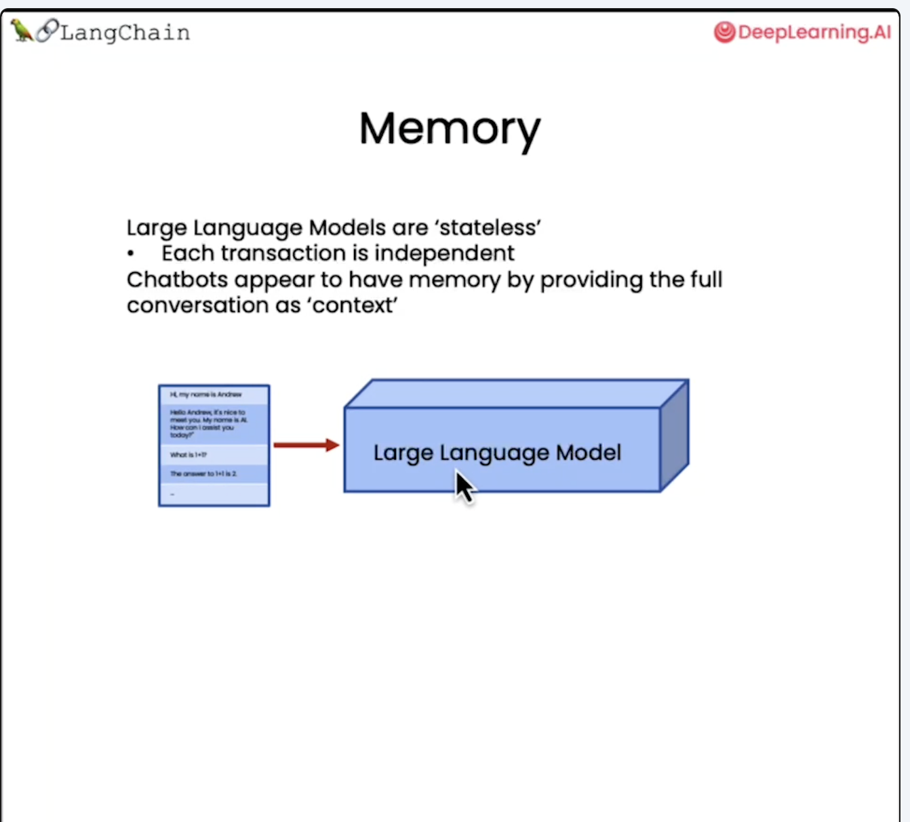
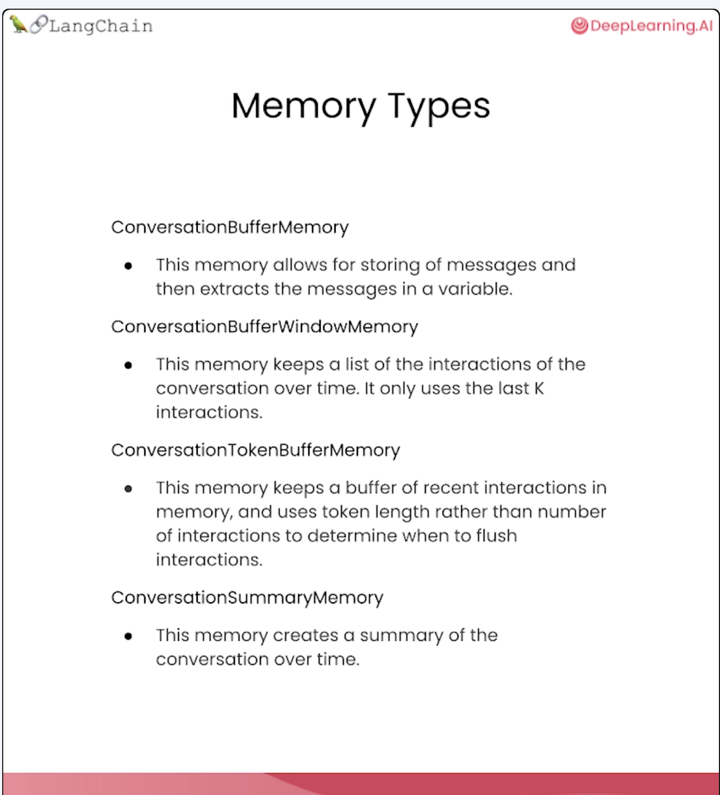
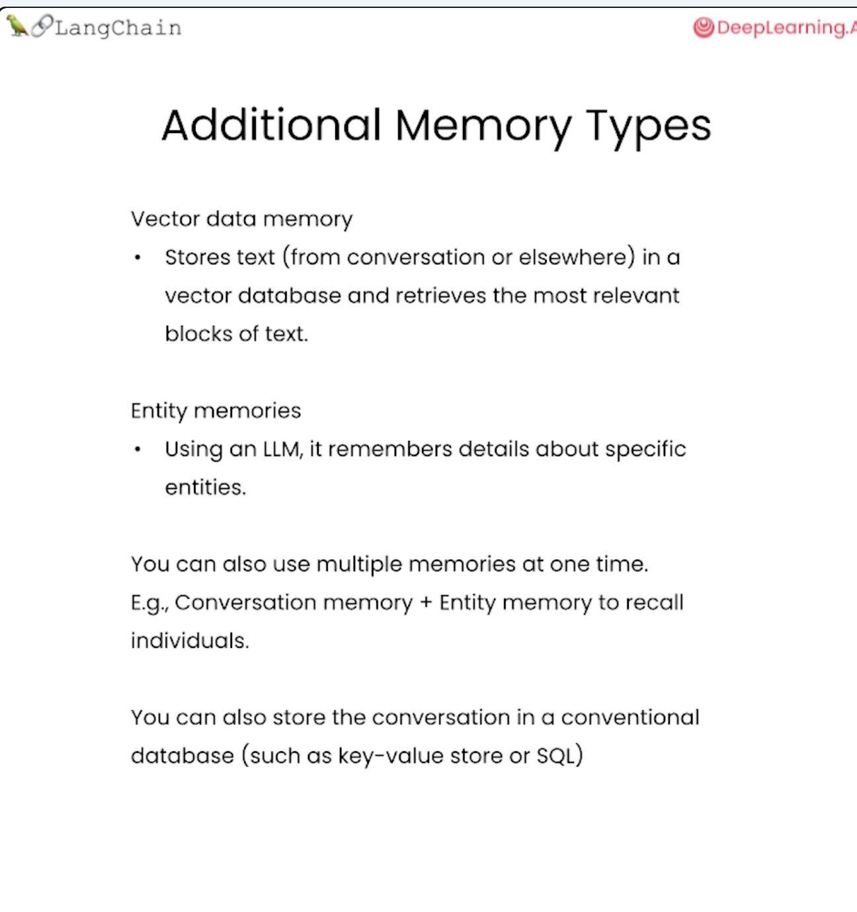

## Introduction

Following notes are taken from the course [Langchain for LLM Applications](https://learn.deeplearning.ai/courses/langchain/lesson/1/introduction)

### Introduction

### Models, Prompts and Parser

Prompt Template

### Memory

### Chains

### Question and Answer

### Evaluation

### Agents

