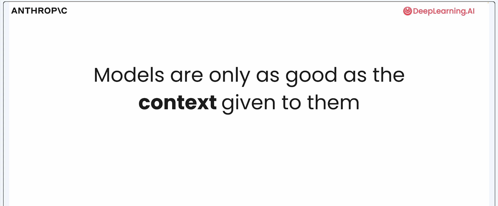
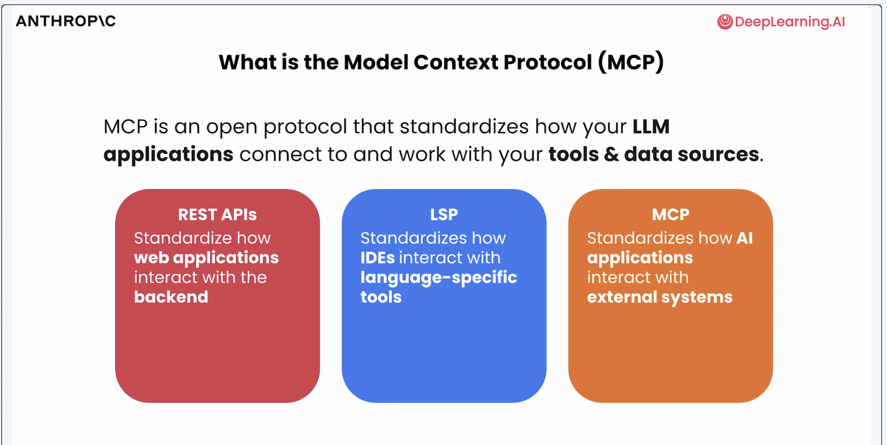
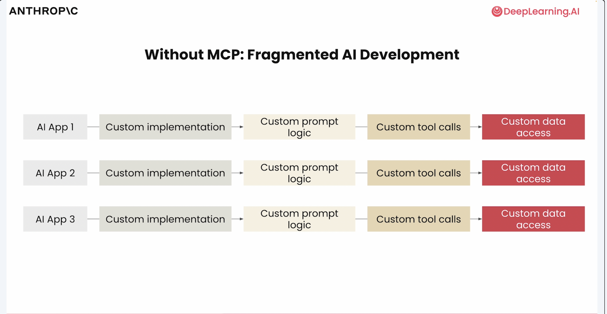
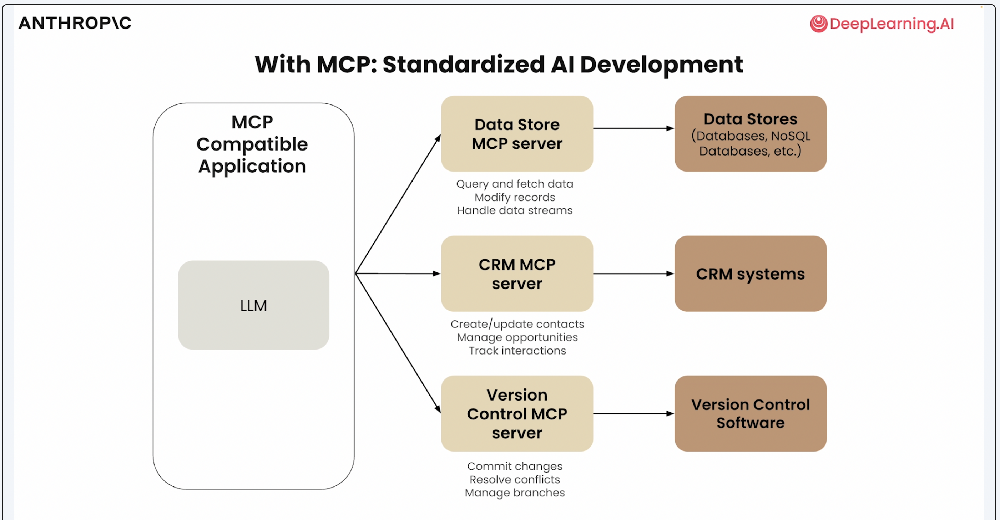
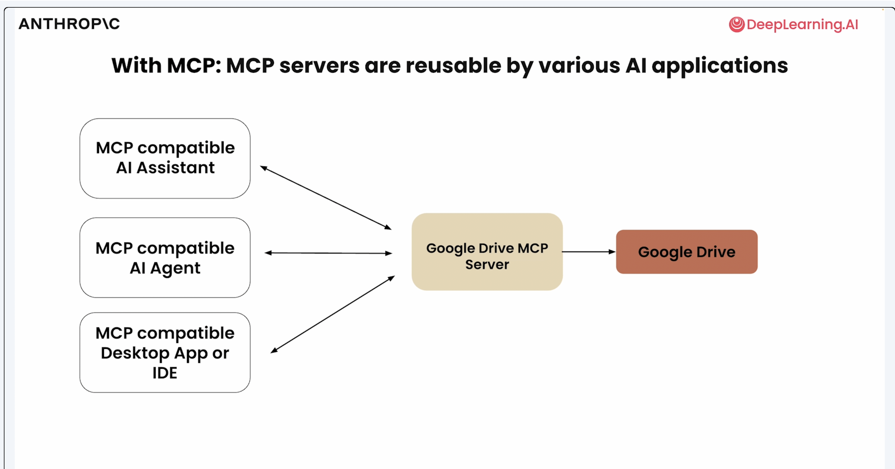
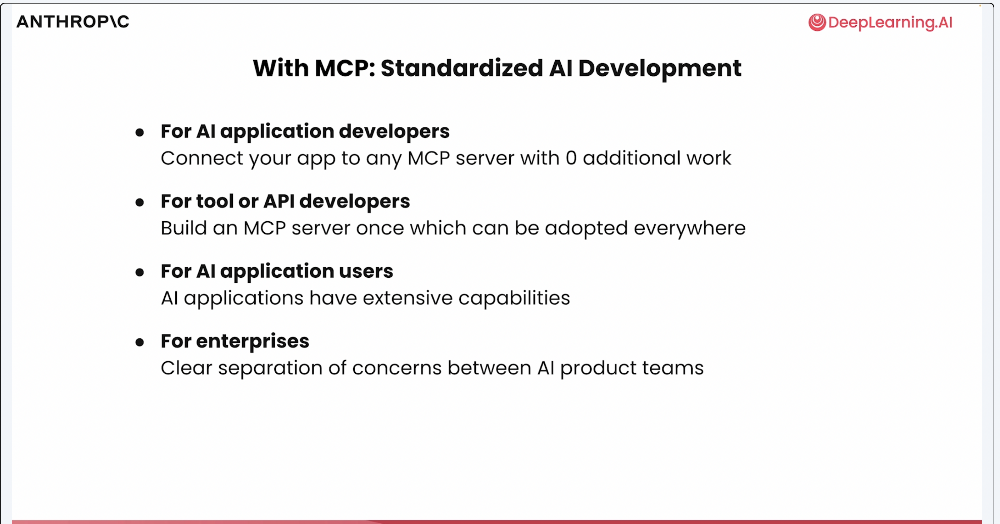
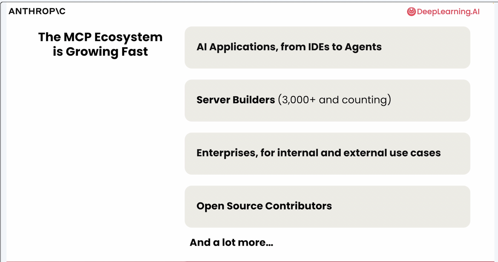
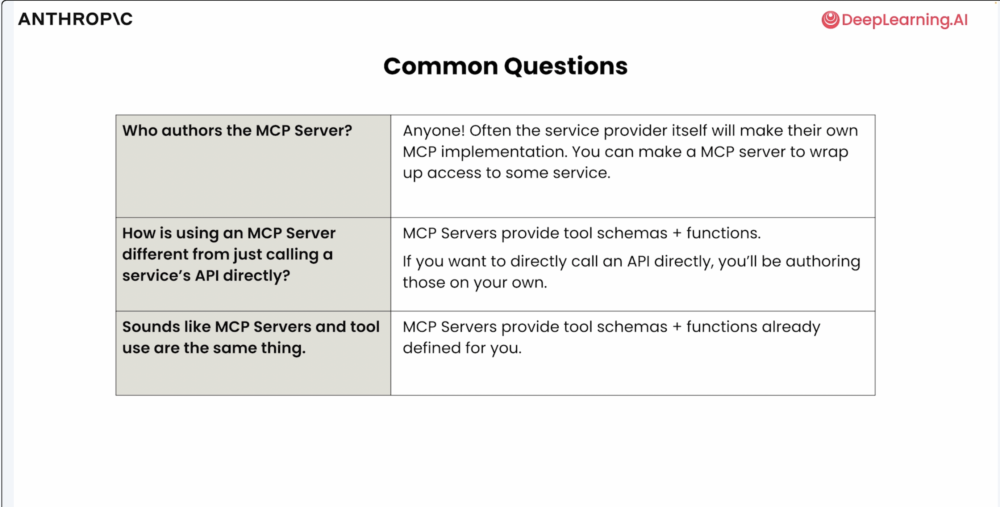

Following lecture slides are from the course [MCP-Build Rich Context AI Apps with Anthropic](https://learn.deeplearning.ai/courses/mcp-build-rich-context-ai-apps-with-anthropic/lesson/ccsd0/why-mcp)

