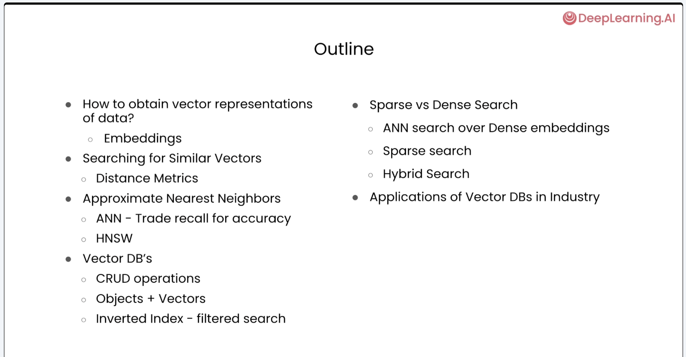
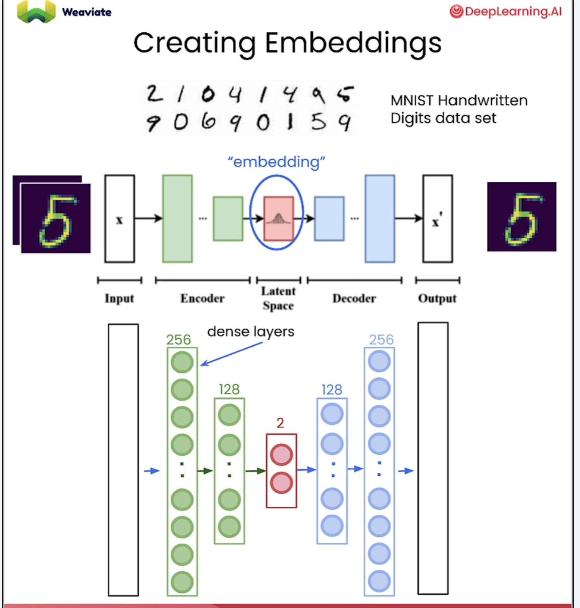
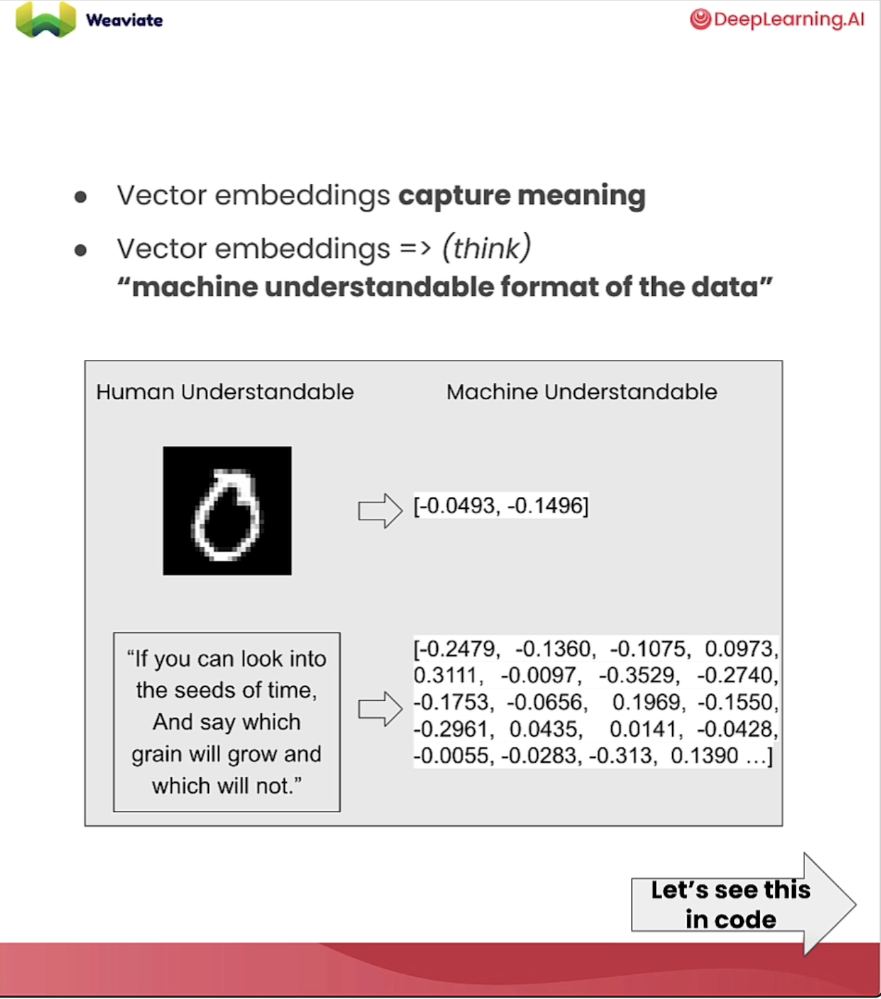

# Vector Databases - From Embeddings to Applications

The following notes are taken from the course from DeepLearning.ai [Course Link](https://learn.deeplearning.ai/courses/vector-databases-embeddings-applications/lesson/dqe6y/introduction)

## Chapter 1 - How to obtain a vector representation of Data

